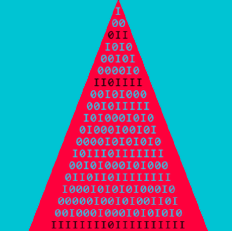

# The objectives of this library

* The library aims to provide the ~100 most interesting integer triangles listed in the OEIS. 

* In addition, it provides a dozen methods for manipulating the triangles.

# Installation

Following the advice of https://stackoverflow.com/a/16196400

Query in your shell: 

    python -m site --user-site

Create the path given in the returned answer: 

    mkdir -p "the answer from the query"

On Windows this creates the directory:

    C:\Users\UserName\AppData\Roaming\Python\Python312\site-packages

Put the file Tables.py (only this file!) there.

# Examples

Next test the installation: Put the following lines in some test.py. (This file can also be found in the root.)

 ### Example 1
    from Tables import Tables, Table, View, StirlingSet

    View(StirlingSet)

### Example 2
    T = [ [1], [0, 1], [0, -2, 1], [0, 3, -6, 1], [0, -4, 24, -12, 1], [0, 5,
    -80, 90, -20, 1], [0, -6, 240, -540, 240, -30, 1], [0, 7, -672, 2835, 
    -2240, 525, -42, 1], [0, -8, 1792, -13608, 17920, -7000, 1008, -56, 1] ]

    Babel = Table(T, "Babel", ["A059297"], True)

    View(Babel)

 ### Example 3
    from functools import cache
    from math import comb as binomial

    @cache
    def abel(n: int) -> list[int]:
        if n == 0: return [1]
        return [binomial(n - 1, k - 1) * n ** (n - k) if k > 0 else 0 
                for k in range(n + 1)]

    Abel = Table(abel, "Abel", ["A137452", "A061356", "A139526"], True)

    View(Abel)

The last example shows how you can use the functionality of Tables with sequences you define yourself.

### Example 4
    for tabl in Tables: 
        print(tabl.id)

This shows the list of the sequences implemented. A brief overview of their relative relevance can be found in the file _statistics.txt.

# How to use

There is only one constructor: Table(...). The parameters are:

    gen: rgen | tabl          # The generator.
    id: str                   # The name of the sequence.
    sim: list[str] = ['']     # References to similar OEIS-sequences.
    invQ: bool | None = None  # Is the triangle invertible? 
                              # Default 'None' means 'I do not know'.

The generator is either a triangular array of integers as in example 2.

Or a function of type: fun(n: int) -> list[int] defined for all nonnegative n as in example 3. 
This function should be decorated with '@cache' and return a list of integers of length n + 1.

A Table T provides the following methods:

    val (n:int, k:int)   -> int  | T(n, k)
    poly(n: int, x: int) -> int  | sum(T(n, k) * x^j for j=0..n)
    flat (size: int)     -> list[int] | flattened form of the first size rows
    diag(n, size: int)   -> list[int] | diagonal starting at the left side
    col (k, size: int)   -> list[int] | k-th column starting at the main diagonal
    row (n: int)         -> trow | n-th row of table
    tab (size: int)      -> tabl | table with size rows
    rev (size: int)      -> tabl | tabel with reversed rows
    adtab (size: int)    -> tabl | table of (upward) anti-diagonals
    acc (size: int)      -> tabl | table with rows accumulated
    mat (size: int)      -> tabl | matrix form of lower triangular array
    inv (size: int)      -> tabl | inverse table
    revinv (size: int)   -> tabl | row reversed inverse
    invrev (size: int)   -> tabl | inverse of row reversed
    off (N: int, K: int) -> rgen | new offset (N, K)
    invrev11 (size: int) -> tabl | invrev from offset (1, 1)
    summap(s: seq, size) -> list[int] | linear transformation induced by T
    invmap(s: seq, size) -> list[int] | inverse transformation induced by T

# For developers

You are invited to share your code and add it to the library. Only sequences already in the OEIS will be considered. Send a pull request!

Observe the design constraints:

  1) No use of extern modules (like SymPy or NumPy); only use standard modules.

  2) All tables are (0,0)-based. If the table in the OEIS is (1,1)-based, adapt it. Often the best way to do this is to prepend a column (1, 0, 0, ...) to the left of the table.

  3) Keep the design philosophy you see in the code: all implementations are based on the rows of a triangle, not on individual terms T(n, k).

  4) We do not aim for one-liners. Readability is important.

# Efficiency

To give an idea of ​​the performance of the library, we provide the following table. It shows the time required to calculate the first 100 rows of each triangle (which corresponds to the calculation of 5050 terms).

                Abel 0.0058 sec
               Andre 0.0314 sec
              Baxter 0.0115 sec
                Bell 0.0027 sec
              Bessel 0.0027 sec
             Bessel2 0.0021 sec
          BinaryPell 0.0026 sec
            Binomial 0.0003 sec
        BinomialBell 0.0029 sec
     BinomialCatalan 0.0045 sec
        BinomialPell 0.0024 sec
    BinomialDiffPell 0.0033 sec
             Catalan 0.0048 sec
        CatalanPaths 0.0046 sec
        CentralCycle 0.0032 sec
          CentralSet 0.0034 sec
              Chains 0.0061 sec
            Charlier 0.0056 sec
          ChebyshevS 0.0057 sec
          ChebyshevT 0.0017 sec
          ChebyshevU 0.0014 sec
         Composition 3.5305 sec
      CompositionMax 0.0002 sec
               CTree 0.0004 sec
            Delannoy 0.0015 sec
        Divisibility 0.0006 sec
           DyckPaths 0.0026 sec
              Euclid 0.0065 sec
               Euler 0.0041 sec
            Eulerian 0.0040 sec
           Eulerian2 0.0024 sec
           EulerianB 0.0035 sec
      EulerianZigZag 0.3982 sec
            EulerSec 0.0022 sec
            EulerTan 0.0022 sec
         FallingFact 0.0013 sec
           FiboLucas 0.0025 sec
        FiboLucasInv 0.0016 sec
        FiboLucasRev 0.0004 sec
           Fibonacci 0.0013 sec
              Fubini 0.0069 sec
         FussCatalan 0.0010 sec
             Gaussq2 0.0044 sec
            Genocchi 0.0025 sec
            Harmonic 0.0048 sec
            HermiteE 0.0018 sec
            HermiteH 0.0020 sec
       HyperHarmonic 0.0028 sec
          Jacobsthal 0.0020 sec
              Kekule 0.0020 sec
       LabeledGraphs 0.0258 sec
            Laguerre 0.0025 sec
                 Lah 0.0018 sec
              Lehmer 0.2156 sec
             Leibniz 0.0020 sec
       LeibnizScheme 0.0009 sec
               Levin 0.0024 sec
             Lozanic 0.0017 sec
               Lucas 0.0014 sec
             Moebius 0.0017 sec
            Monotone 0.0029 sec
             Motzkin 0.0068 sec
         MotzkinPoly 0.0016 sec
            Narayana 0.0055 sec
            Naturals 0.0017 sec
          Nicomachus 0.0015 sec
                 One 0.0004 sec
            Ordinals 0.0005 sec
        OrderedCycle 0.0031 sec
             Parades 0.0648 sec
           Partition 0.0094 sec
       PartitionDist 0.9134 sec
        PartitionMax 0.0007 sec
              Pascal 0.0011 sec
           Polygonal 0.0011 sec
         PowLaguerre 0.0039 sec
          Rencontres 0.0023 sec
          RisingFact 0.0016 sec
           Schroeder 0.0026 sec
          SchroederL 0.0023 sec
          SchroederP 0.0023 sec
              Seidel 0.0018 sec
         SeidelBoust 0.0002 sec
          Sierpinski 0.0015 sec
       StirlingCycle 0.0019 sec
        StirlingCyc2 0.0013 sec
        StirlingCycB 0.0044 sec
         StirlingSet 0.0017 sec
        StirlingSet2 0.0013 sec
        StirlingSetB 0.0039 sec
           Sylvester 0.1575 sec
        TernaryTrees 0.0013 sec
             WardSet 0.0026 sec
           Worpitzky 0.0036 sec
